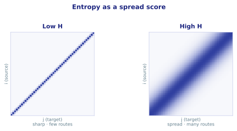
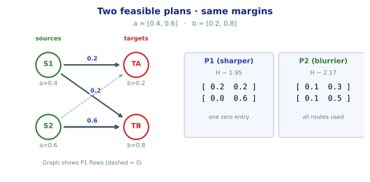
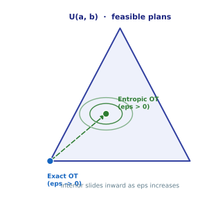
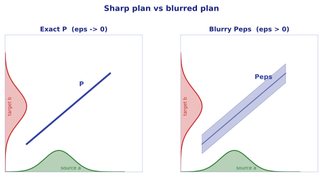
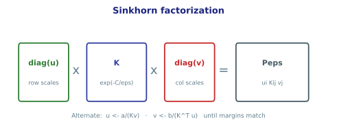

# 01. Entropy & Sinkhorn

*Transcribed and cleaned up from my handwritten notes (`notes/Entropy_in_Optimal_Transport.pdf`). Foundational walkthrough — same story as the seminar notes, just readable.*

## Exact OT

$$
L_C(a,b)
=\min_{P\in U(a,b)}\langle C,P\rangle
=\min_{P\in U(a,b)}\sum_{ij}C_{ij}P_{ij}.
$$

Here $L_C$ is the result of the minimization (the cheapest cost), $P$ is the transport plan, and $C$ is the cost table. In words: find the cheapest way to ship supply $a$ (source $\sim\mu$) to demand $b$ (target $\sim\nu$), given $C$ and a plan $P$.

The feasible set $U(a,b)$ is the set of non-negative matrices that move mass legally — every legal way to route mass so that row sums equal $a$ and column sums equal $b$.

## Exact OT is sharp — and combinatorial

A fundamental fact of linear programming: the cheapest plan is sharp and sparse. Minimizing a linear function over a convex set defined by linear constraints, the optimum is guaranteed to sit at a **corner** (a vertex of the polytope).

!!! warning "The problem"
    Exact OT is accurate, but slow — a combinatorial search. Idea from the notes: *blur* the plan $P$ so the solution is smooth instead of a hard corner.

## Entropy = a spread score

$$
H(P)=-\sum_{ij}P_{ij}(\log P_{ij}-1).
$$

$H$ is a scalar that measures blurriness. Low $H$ means a sharp plan (few routes carrying mass); high $H$ means the mass is spread across many routes.

{ width="100%" }

### Worked $2\times 2$ example

Same tiny masses from the recap: sources $m_1=10$, $m_2=15$ and targets $m_A=5$, $m_B=20$ (total mass $25$). Normalize to probability vectors

$$
a=\begin{bmatrix}0.4\\0.6\end{bmatrix},\qquad
b=\begin{bmatrix}0.2\\0.8\end{bmatrix}.
$$

Two different legal plans (same margins, different routing):

$$
P_1=\begin{bmatrix}0.2&0.2\\0&0.6\end{bmatrix}
\quad\text{with}\quad
H(P_1)\approx 1.95,
\qquad
P_2=\begin{bmatrix}0.1&0.3\\0.1&0.5\end{bmatrix}
\quad\text{with}\quad
H(P_2)\approx 2.17.
$$

Both are in $U(a,b)$. The sharper plan $P_1$ zeros out the $S_2\to T_A$ route; the blurrier $P_2$ uses every route and scores a higher spread. Explicitly for $P_2$,

$$
H(P_2)=-\Big[
0.1(\log 0.1-1)+0.3(\log 0.3-1)+0.1(\log 0.1-1)+0.5(\log 0.5-1)
\Big]\approx 2.17.
$$

{ width="100%" }

## Entropic OT: add $-\varepsilon H$

Add $-\varepsilon H$ to the original objective:

$$
L_C^{\varepsilon}(a,b)
=\min_{P\in U(a,b)}\langle C,P\rangle-\varepsilon H(P).
$$

Here $\varepsilon>0$ is the knob that controls blur. At $\varepsilon=0$ the optimum is pinned to a corner of the feasible set. Adding $-\varepsilon H$ turns that flat triangle into a **smooth bowl**; the interior solution slides inward as $\varepsilon$ grows.

{ width="72%" }

Visually, exact OT concentrates mass on a thin coupling; entropic OT spreads that mass into a soft band while still matching the source and target marginals.

{ width="100%" }

## Why $P^{\varepsilon}$ is guaranteed and unique

Start again from entropy:

$$
H(P)=-\sum_{ij}P_{ij}(\log P_{ij}-1).
$$

Differentiate entrywise (for $P_{ij}>0$):

$$
\frac{\partial H}{\partial P_{ij}}=-\log P_{ij},
\qquad
\frac{\partial^2 H}{\partial P_{ij}^2}=-\frac{1}{P_{ij}}.
$$

The second derivative is the curvature. The Hessian is diagonal,

$$
\operatorname{Hess} H=-\operatorname{diag}\!\left(\frac{1}{P_{ij}}\right),
$$

and that curvature is negative everywhere because $P_{ij}>0$ in the interior. So $H$ is **concave**, which means $-\varepsilon H$ is **strictly convex** (a bowl). A strictly convex objective over the convex set $U(a,b)$ has exactly one minimizer: there is precisely one best plan $P^{\varepsilon}$, sitting at the lowest point of the bowl.

## The trade-off

$$
\langle C,P^{\varepsilon}\rangle
\;\ge\;
\langle C,P^{\star}\rangle
=L_C(a,b).
$$

The left side is the blurred plan (what Sinkhorn returns). The right side is the sharp plan from combinatorial search. You never beat the exact transport cost by blurring — you pay a little for smoothness and uniqueness.

| Exact OT ($\varepsilon\to 0$) | Entropic OT ($\varepsilon>0$) |
|---|---|
| Sharp / sparse | Blurry / spread |
| $\sim O(n^3)$ LP | Sinkhorn iterations |
| Hard for NNs (non-diff) | Smooth, unique, usable as a loss |

## Sinkhorn's algorithm

We want to minimize $\langle C,P\rangle-\varepsilon H(P)$ over $P\in U(a,b)$. The objective is strictly convex, so there is one unique $P^{\varepsilon}$ in the smooth interior of $U(a,b)$. To enforce the margin constraints, set up Lagrange multipliers (dual variables): $f$ for the row constraint $P\mathbf{1}=a$, and $g$ for the column constraint $P^\top\mathbf{1}=b$.

### Lagrangian and stationarity

$$
\mathcal{L}(P,f,g)
=\langle C,P\rangle-\varepsilon H(P)
-\langle f,\,P\mathbf{1}-a\rangle
-\langle g,\,P^\top\mathbf{1}-b\rangle.
$$

Stationarity in $P$ means the slope is zero for every entry:

$$
\frac{\partial\mathcal{L}}{\partial P_{ij}}=0
\quad\Longrightarrow\quad
C_{ij}+\varepsilon\log P_{ij}-f_i-g_j=0.
$$

Solve for the plan entry:

$$
P_{ij}=e^{(f_i+g_j-C_{ij})/\varepsilon}
=e^{f_i/\varepsilon}\;e^{-C_{ij}/\varepsilon}\;e^{g_j/\varepsilon}.
$$

Read that as three factors — a row scaling, a cost factor, and a column scaling. Set

$$
u_i=e^{f_i/\varepsilon},\qquad
v_j=e^{g_j/\varepsilon},\qquad
K_{ij}=e^{-C_{ij}/\varepsilon},
$$

so in matrix form

$$
P=\operatorname{diag}(u)\,K\,\operatorname{diag}(v).
$$

The Gibbs kernel $K=e^{-C/\varepsilon}$ is a **desirability** table: cheap routes are pushed toward $1$, dear routes toward $0$.

{ width="100%" }

### Alternating updates

The margin constraints $P\mathbf{1}=a$ and $P^\top\mathbf{1}=b$ become

$$
u\odot(Kv)=a,\qquad v\odot(K^\top u)=b,
$$

and therefore

$$
u=\frac{a}{Kv},\qquad v=\frac{b}{K^\top u}
$$

(elementwise). Two equations, two unknowns — and each needs the other — so we solve them by alternating.

```text
K = exp(-C / ε)
v = ones
repeat:
    u ← a / (K v)      # fix rows  → row-sum = a
    v ← b / (Kᵀ u)     # fix cols  → col-sum = b
return P = diag(u) K diag(v)
```

Mass on route $i\to j$ is simply $P_{ij}=u_i\,K_{ij}\,v_j$.

### Why it works

There exists a $(u,v)$ pair that fixes **both** margins because $K=e^{-C/\varepsilon}$ is strictly positive entrywise. That existence statement is **Sinkhorn's theorem**.

In practice $P$ is updated alternately — fix rows, then fix cols, then rows again — until the scalings settle. The updates stop as they converge (like a damped oscillation): after a row fix the columns drift a little; after a column fix the rows drift a little; and those drifts shrink every round until both margins lock.

!!! tip "Next"
    Run the same story in code — [02. Sinkhorn notebook](02_sinkhorn_demo.ipynb).
